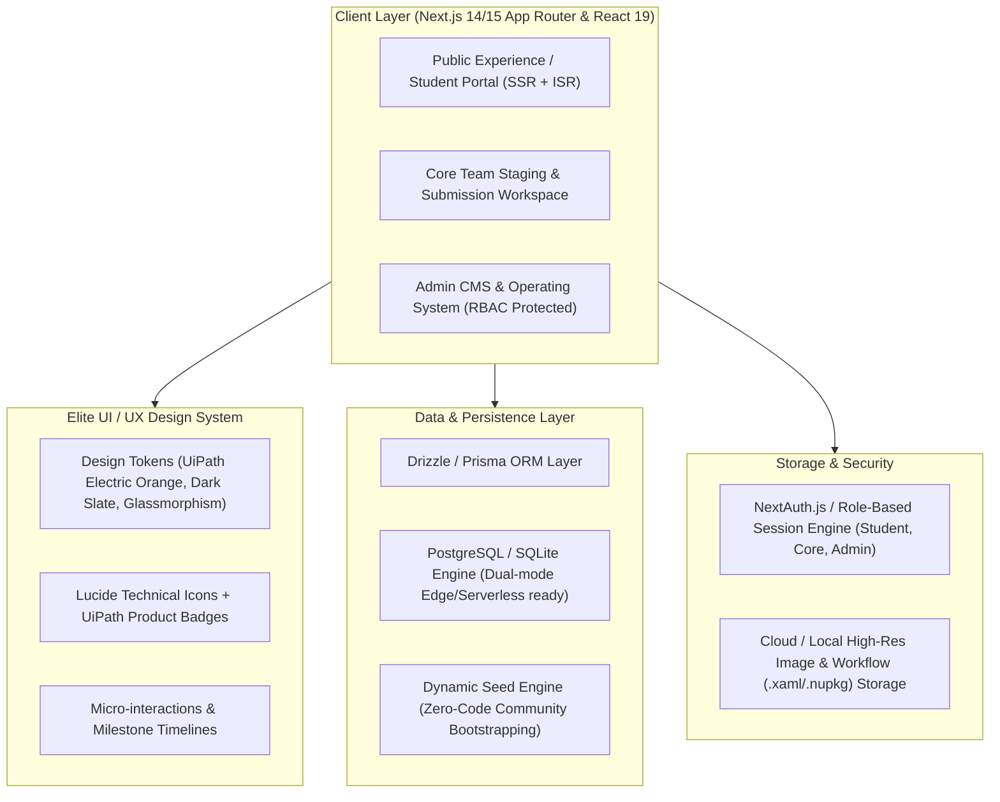
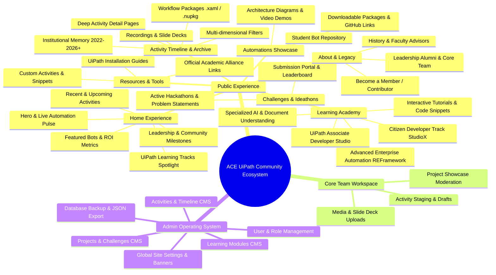
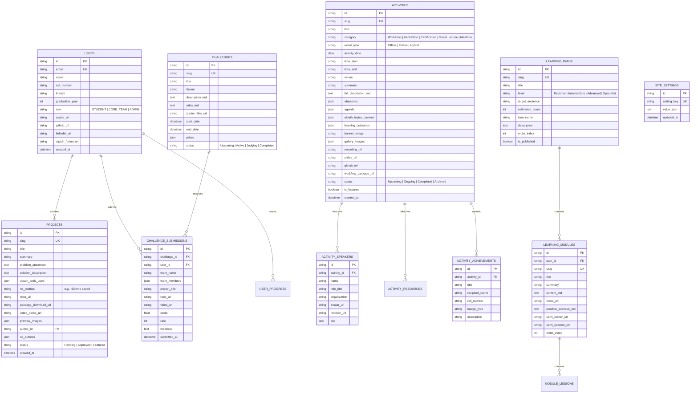

# System Architecture Proposal & Implementation Plan: ACE UiPath Community Ecosystem

**Project**: Digital Ecosystem & Operating System for ACE UiPath Community (ACE Engineering College)  
**Role**: Lead Product Architect & Senior Full-Stack Engineer  
**Status**: Proposal & Architecture Blueprint (Awaiting Approval)  

---

## 1. Executive Summary & Existing Project Inspection

### 1.1 Repository Inspection

- **Location**: `d:\ace uipath communtiy\ACE-UiPath-Community`
- **Remote Origin**: `https://github.com/kanchana-Tejaswy/ACE-UiPath-Community.git`
- **Existing Assets**: Freshly initiated Git repository with standard `README.md`.
- **Architectural Advantage**: Zero legacy technical debt, no deprecated frameworks, and no spaghetti dependencies. We have a pristine clean-slate foundation to build an enterprise-grade, modern digital ecosystem designed to scale for 5+ years across student batches without requiring source code modifications for ongoing community operations.

---

## 2. Technology Positioning: UiPath Centricity

> [!IMPORTANT]
> **Strict Domain Identity**: This platform is the authoritative digital operating system for the **ACE UiPath Community**. UiPath Enterprise Automation is the hero technology. Supporting skills (Python, C#, REST APIs, Generative AI, SQLite/PostgreSQL, Orchestrator Webhooks) are presented strictly as accelerators for building advanced UiPath automations (e.g., UiPath C# expressions, Python Custom Activities, Document Understanding ML models, Orchestrator API integration).

---

## 3. Technology Stack Selection

### 3.1 Frontend & Core Framework

- **Framework**: **Next.js 14/15 with App Router** (React 19, TypeScript).
- **Rendering Strategy**:
  - **Static Site Generation (SSG) / Incremental Static Regeneration (ISR)** for high-traffic public pages (Activities Timeline, Learning Paths, Hall of Fame, Tutorials) for sub-millisecond TTFB and perfect SEO.
  - **Client-Side Rendering (CSR) with SWR/React Query** for real-time Admin CMS tables, filter chips, bot package download counters, and interactive challenges.
- **Styling**: Modern CSS System with CSS Variables / Vanilla Design Tokens + Utility Classes for ultra-fine layout control. Designed to match Apple/Linear/Vercel/Stripe aesthetic standards.
- **Motion & Micro-interactions**: Framer Motion for scroll-linked timeline progressions, interactive bot architecture flows, and modal drawers.

### 3.2 Backend & Data Persistence

- **Database**: Dual-driver Architecture (PostgreSQL via Supabase/Neon, with zero-config local SQLite/libSQL for instant development and offline demos).
- **ORM / Query Builder**: Prisma / Drizzle ORM with fully typed schema definitions, migrations, and relational integrity.
- **Built-in Mock/Seed CMS Engine**: Pre-populated with realistic ACE UiPath Community historical activities (bootcamps, hackathons, certification drives, citizen developer workshops) so the platform is immediately full of vibrant, structured data on day 1.

### 3.3 Authentication & Authorization

- **Role-Based Access Control (RBAC)**:
  - `PUBLIC / STUDENT` (No login required for viewing, learning, exploring; one-click student login for project/challenge submissions).
  - `CORE_TEAM` (Restricted content staging, event draft creation, photo/recording uploads, project review).
  - `ADMIN` (Full CMS access, site settings, role promotion, activity publishing, data backups).

---

## 4. Information Architecture (IA)

---

## 5. Database Schema & Entity Relationships (ERD)

---

## 6. Three-Tier User Experience & Permission Matrix

| Capability | Public / Student | Core Team Member | Administrator |
| :--- | :---: | :---: | :---: |
| **Browse Activities, Search & Filter Timeline** | ✅ | ✅ | ✅ |
| **View Activity Institutional Memory & Download .XAML** | ✅ | ✅ | ✅ |
| **Access Learning Paths, Tutorials & Snippets** | ✅ | ✅ | ✅ |
| **View Showcase Bots & Download Packages** | ✅ | ✅ | ✅ |
| **Submit Bot for Showcase / Challenge** | ✅ (Auth) | ✅ | ✅ |
| **Apply for Core Team / Mentor Role** | ✅ (Auth) | ✅ | ✅ |
| **Draft New Activity / Workshop Record** | ❌ | ✅ | ✅ |
| **Upload Photos, Recordings, Slides for Activity** | ❌ | ✅ | ✅ |
| **Review & Moderate Student Showcase Submissions** | ❌ | ✅ | ✅ |
| **Publish / Archive Activities to Public Timeline** | ❌ | ❌ | ✅ |
| **Manage Learning Paths & Lesson Content** | ❌ | ❌ | ✅ |
| **Manage Core Team Members & Roles** | ❌ | ❌ | ✅ |
| **Global Settings (Banners, Notices, Socials)** | ❌ | ❌ | ✅ |
| **Database Backup, Seed & JSON Export** | ❌ | ❌ | ✅ |

---

## 7. Deep Activity Timeline: Institutional Memory Architecture

Every single activity in the ACE UiPath Community serves as a permanent knowledge asset. The Activity Detail page will feature:

1. **Header & Metadata Bar**: Title, Date, Time, Venue, Delivery Mode (Offline/Online/Hybrid), Status, Category Badge, UiPath Tools Tag Bar (e.g., `Studio`, `REFramework`, `Document Understanding`, `Orchestrator`).
2. **Hero Highlights & Live Status**: Countdown for upcoming events, or full recap metrics for completed events.
3. **Objectives & Agenda Matrix**: Structured breakdown of what was taught and executed minute-by-minute.
4. **Speaker & Mentor Cards**: Distinguished speaker profiles with LinkedIn and company badges.
5. **Interactive Learning Outcomes**: Clear technical skills acquired by attendees (e.g., "Configuring Orchestrator Assets", "Building State Machine exception handlers").
6. **Downloadable Automation Artifacts Vault**:
   - Presentation Slide Deck (PDF/Slides viewer).
   - Starter Code (`.xaml` or `.zip`).
   - Final Solution Package (`.nupkg` / `.xaml`).
   - Session Video Recording (Embedded responsive player).
7. **Activity Gallery & Moments**: High-resolution photo masonry grid with lightbox.
8. **Student Recognition & Achievements**: Attendees who won awards, badges, or certifications during this specific activity.
9. **Related Activities & Learning Tracks**: Direct links to corresponding modules in the Learning Academy.

---

## 8. Admin CMS & Non-Developer Governance

The Admin CMS allows the community to run autonomously for years without writing code:

- **WYSIWYG & Markdown Live Editor**: For activity descriptions, announcements, learning lessons, and hackathon rules.
- **Asset Attachment Manager**: Drag-and-drop support for photo albums, YouTube/Drive recording links, and `.xaml` packages.
- **Dynamic Site Configurator**: Change hero headlines, announcement marquee banner, contact emails, Discord/WhatsApp community links, and UiPath Academic Alliance accreditation info.
- **Audit & Export Engine**: Full JSON backup and restore capabilities so that outgoing student core teams can export a complete snapshot of all community data at the end of each academic year.

---

## 9. UI/UX Design System Specification (World-Class Aesthetics)

Adhering to the elite standard of **Apple, Linear, Stripe, and Vercel**:

- **Color Palette**:
  - `UiPath Electric Orange`: `#FA4616` (Primary Action & Accent Glow)
  - `Deep Obsidian Canvas`: `#0A0B0E` (Surface background, eliminating eye strain)
  - `Dark Titanium Surface`: `#14171F` / `#1C202B` (Cards & Drawers)
  - `Subtle Micro-Borders`: `rgba(255, 255, 255, 0.08)`
  - `High-Contrast Text`: `#F8FAFC` (Headlines), `#94A3B8` (Muted Technical Metadata)
  - `UiPath Enterprise Cobalt`: `#0070F3` (Secondary accents for Cloud/API topics)
  - `Success Emerald`: `#10B981` (Automations passing, live status)
- **Typography**: Inter / Geist font family, featuring precise typographic scales and mono accents (`font-mono`) for workflow variables and activity IDs.
- **Design Elements**:
  - Glassmorphic navigation header with backdrop blur (`backdrop-blur-md`).
  - Active timeline vertical laser-rail with animated node status.
  - Interactive bot preview cards with hover-tilt & glow effects.
  - Clean, accessible command-palette / search bar (`Ctrl+K`) for finding any activity, bot, or tutorial instantly.

---

## 10. Phased Implementation Roadmap

### Phase 1: Core Foundation & Design System Setup

- Initialize Next.js 14/15 TypeScript application inside `ACE-UiPath-Community`.
- Configure Vanilla Design Tokens, typography, layout wrappers, glassmorphic navigation, and footer.
- Build Database Layer (Prisma/Drizzle schema, SQLite/Postgres adapter, and rich initial seed database with realistic ACE UiPath community history).

### Phase 2: Public Experience & Interactive Timeline

- Build dynamic **Homepage** with live stats, upcoming event highlight, learning tracks preview, and community showcase.
- Build **Activity Timeline & Archive** (`/activities`) with search, category filtering, year filtering, and timeline view.
- Build **Deep Activity Detail Page** (`/activities/[slug]`) featuring full institutional memory (speakers, agenda, recordings, `.xaml` workflow downloads, photo gallery).

### Phase 3: Learning Academy & Automations Showcase

- Build **Learning Paths & Tutorials Hub** (`/learn`, `/learn/[pathSlug]/[moduleSlug]`) with syntax highlighting, downloadable starter code, and progress tracking.
- Build **Projects & Bot Showcase** (`/projects`) with package downloads, problem-solution views, and student submission modal.
- Build **Challenges & Hackathons Portal** (`/challenges`) and **Resource Library** (`/resources`).
- Build **About, Legacy & Leadership Wall** (`/about`, `/join`).

### Phase 4: Core Team & Admin CMS Operating System

- Build **Admin Command Center** (`/admin`):
  - Activities Manager (Create, Edit, Upload Media, Publish).
  - Learning Paths & Modules Manager.
  - Showcase & Challenge Submissions Approval Queue.
  - Site Settings & Global Banner Configurator.
  - Data Export & Backup Utility.
- Build **Role-Based Auth & Core Team Portal** (`/core`).

### Phase 5: Polish, Performance Verification & Delivery

- End-to-end responsiveness testing (Mobile 375px -> 4K).
- Accessibility (WCAG AA), SEO meta tags, OpenGraph previews for activities.
- Comprehensive user walkthrough and documentation.

---

## 11. Verification & Quality Assurance Plan

### Automated Verification

- Next.js production build check: `npm run build` (zero type errors, zero broken imports).
- Schema validation & database seed verification.
- Linting & accessibility checks.

### Manual Verification

- Verify that every activity detail page opens smoothly and renders all institutional memory sections (agenda, speakers, downloads, gallery).
- Verify filter and search functionality on the Activities Timeline without page reloads.
- Verify Admin CMS updates reflect immediately on public-facing pages.
- Verify non-logged-in students have zero barrier to explore any page or download materials.
