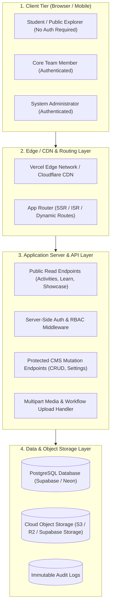

# 02 — System Architecture Specification

**Product**: ACE UiPath Community Digital Operating System  
**Document Version**: 2.0  
**Scope**: High-Level System Design, Layers, Data Flow & Component Topography  

---

## 1. High-Level Target Production Architecture

---

## 2. Current Prototype Architecture vs. Target Production Architecture

### 2.1 Current Prototype Architecture (Audited)
* **Execution Model**: Client-Side Single Page Application (React 18 + Vite + TypeScript).
* **State & Persistence**: In-memory React hooks initialized via [`src/data/store.ts`](file:///d:/ace%20uipath%20communtiy/ACE-UiPath-Community/src/data/store.ts) with `localStorage` fallback to [`src/data/initialData.ts`](file:///d:/ace%20uipath%20communtiy/ACE-UiPath-Community/src/data/initialData.ts).
* **Data Flow**: Admin form submit → React state update → `localStorage.setItem` → `window.dispatchEvent` → local re-render on active tab.
* **Limitations**: Zero server backend; changes are trapped in the admin's personal browser; no multi-user synchronization.

### 2.2 Target Production Architecture
* **Execution Model**: Next.js App Router (React 19 / Node.js 20+) with hybrid rendering:
  - **Static Site Generation (SSG) & Incremental Static Regeneration (ISR)** for high-traffic public pages (Activities Timeline, Learning Paths, Hall of Fame, Tutorials) ensuring sub-100ms response times.
  - **Server-Side Rendering (SSR)** with React Server Components for personalized student dashboards and live moderation queues.
  - **Server Actions & Typed REST Endpoints** for Admin CMS mutations with Zod schema validation.
* **Persistence Layer**: Managed PostgreSQL instance (Supabase or Neon) queried via Prisma or Drizzle ORM.
* **Authentication**: Supabase Auth or NextAuth with HTTP-only session cookies and JWT verification.
* **Object Storage**: S3-compatible cloud bucket for `.xaml` workflow files, `.nupkg` packages, slide decks, and high-resolution event photography.

---

## 3. Data Flow Topography

### Scenario A: Public Student Browses Activities (Read Path)
1. Student requests `https://uipath.aceec.ac.in/activities`.
2. Edge CDN delivers pre-rendered HTML (ISR cached).
3. Client-side filter chips allow instant sub-millisecond filtering by Year, Category, Mode, and Topics.
4. Clicking an activity loads `/activities/[slug]` with the full institutional memory record.
5. All requests execute with **zero authentication barrier**.

### Scenario B: Administrator Updates Homepage Banner & Announcement (Write Path)
1. Administrator logs into `/admin` with verified credentials.
2. Server validates Admin session cookie via RBAC middleware.
3. Admin updates announcement ticker text in the CMS form.
4. Request dispatches via secure Server Action / POST `/api/admin/settings`.
5. Backend validates input schema via Zod and executes `UPDATE site_settings SET ...` in PostgreSQL.
6. Server logs action to `audit_logs` table.
7. Next.js triggers `revalidatePath('/')` or `revalidateTag('site-settings')`.
8. All students visiting the platform globally immediately receive the updated announcement on next request.

### Scenario C: Core Team Attaches Workshop Slide Deck & .XAML Package (Upload Path)
1. Core Team member navigates to `/core` and selects an activity.
2. Member selects a `.xaml` or `.zip` file from their local disk.
3. Client initiates pre-signed upload to cloud object storage.
4. Object storage returns permanent secure asset URL.
5. Backend updates the `activities` table linking the asset URL to `workflow_package_url`.
6. Public Activity Detail page immediately displays the "Download .XAML Starter" button.
