# 03 — Database Architecture & Schema Specification

**Product**: ACE UiPath Community Digital Operating System  
**Database Engine**: PostgreSQL 15+ (Hosted on Supabase or Neon)  
**ORM / Schema Layer**: Prisma ORM / Drizzle ORM  

---

## 1. Relational Entity-Relationship Diagram (ERD)

```mermaid
erDiagram
    USERS ||--o{ PROJECTS : authors
    USERS ||--o{ CHALLENGE_SUBMISSIONS : submits
    USERS ||--o{ AUDIT_LOGS : performs
    ACTIVITIES ||--o{ ACTIVITY_SPEAKERS : features
    ACTIVITIES ||--o{ ACTIVITY_AGENDA : schedules
    ACTIVITIES ||--o{ ACTIVITY_ACHIEVEMENTS : awards
    ACTIVITIES ||--o{ ACTIVITY_MEDIA : contains
    LEARNING_PATHS ||--o{ LEARNING_MODULES : contains
    CHALLENGES ||--o{ CHALLENGE_SUBMISSIONS : receives

    USERS {
        uuid id PK
        string email UK
        string name
        string roll_number
        string branch
        int graduation_year
        enum role "STUDENT | CORE_TEAM | ADMIN"
        string avatar_url
        string github_url
        string linkedin_url
        timestamp created_at
    }

    ACTIVITIES {
        uuid id PK
        string slug UK
        string title
        enum category "Workshop | Hackathon | Certification | Bootcamp | Guest_Lecture"
        enum event_type "Offline | Online | Hybrid"
        date activity_date
        string time_start
        string time_end
        string venue
        text summary
        text full_description_md
        text[] objectives
        text[] uipath_topics_covered
        text[] learning_outcomes
        string banner_image_url
        string recording_url
        string slides_url
        string github_url
        string workflow_package_url
        enum status "Upcoming | Ongoing | Completed | Archived"
        boolean is_featured
        timestamp created_at
        timestamp updated_at
    }

    ACTIVITY_SPEAKERS {
        uuid id PK
        uuid activity_id FK
        string name
        string role_title
        string organization
        string avatar_url
        string linkedin_url
        text bio
        int order_index
    }

    ACTIVITY_AGENDA {
        uuid id PK
        uuid activity_id FK
        string time_slot
        string title
        text description
        string speaker_name
        int order_index
    }

    ACTIVITY_ACHIEVEMENTS {
        uuid id PK
        uuid activity_id FK
        string title
        string recipient_name
        string roll_number
        string badge_type
        text description
    }

    ACTIVITY_MEDIA {
        uuid id PK
        uuid activity_id FK
        string media_url
        enum media_type "IMAGE | VIDEO | SLIDES | XAML"
        string caption
        int order_index
    }

    LEARNING_PATHS {
        uuid id PK
        string slug UK
        string title
        string tagline
        enum level "Beginner | Intermediate | Advanced | Specialist"
        string target_audience
        int estimated_hours
        string icon_name
        text description
        int order_index
        boolean is_published
    }

    LEARNING_MODULES {
        uuid id PK
        uuid path_id FK
        string slug UK
        string title
        text summary
        int duration_minutes
        enum level "Beginner | Intermediate | Advanced | Architect"
        string uipath_tool
        text content_md
        text practice_exercise_md
        string starter_code_url
        string solution_code_url
        int order_index
    }

    PROJECTS {
        uuid id PK
        string slug UK
        string title
        string tagline
        text summary
        text problem_statement
        text solution_description
        string[] uipath_tools_used
        string roi_metrics
        string repo_url
        string package_download_url
        string video_demo_url
        string[] preview_images
        string author_name
        string author_roll_number
        string author_branch
        string author_linkedin
        enum status "Pending | Approved | Featured"
        int download_count
        int upvotes
        timestamp created_at
    }

    CHALLENGES {
        uuid id PK
        string slug UK
        string title
        string theme
        enum category "Monthly_Sprint | Hackathon | Ideathon | Bug_Bash"
        enum status "Upcoming | Active | Judging | Completed"
        date start_date
        date end_date
        string prize_pool
        text description_md
        text rules_md
        text[] evaluation_criteria
        string starter_dataset_url
        int submission_count
    }

    CHALLENGE_SUBMISSIONS {
        uuid id PK
        uuid challenge_id FK
        uuid user_id FK
        string team_name
        string team_members_text
        string project_title
        string repo_url
        string video_demo_url
        float score
        int rank
        text feedback
        timestamp submitted_at
    }

    RESOURCES {
        uuid id PK
        string title
        enum category "Cheat_Sheet | Workflow_Template | Custom_Activity | Guide | Official_Certification"
        text description
        string uipath_version
        string download_url
        enum file_type "XAML | PDF | NUPKG | DOCS"
        text[] tags
        int download_count
        timestamp created_at
    }

    SITE_SETTINGS {
        string key PK
        jsonb value
        timestamp updated_at
    }

    AUDIT_LOGS {
        uuid id PK
        uuid user_id FK
        string action
        string entity_type
        string entity_id
        jsonb changes
        timestamp created_at
    }
```

---

## 2. Table Specifications & Indexes

1. **`activities`**:
   - `slug`: Unique index for clean SEO routing (`/activities/reframework-masterclass-2026`).
   - `activity_date`: Index for descending chronological timeline queries.
   - `category`, `event_type`, `status`: Indexes for multi-dimensional filtering.
2. **`learning_modules`**:
   - Composite unique index on `(path_id, order_index)` to preserve curriculum sequencing.
3. **`projects`**:
   - Index on `status` to filter `Approved` / `Featured` bots in public views while isolating `Pending` bots in the moderation queue.
4. **`site_settings`**:
   - Key-value JSONB store for global configuration (`hero_tagline`, `announcement_ticker`, `uipath_alliance_id`, `live_counters`).
