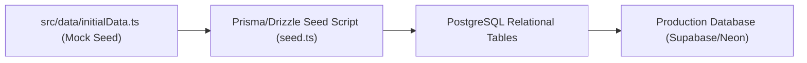

# 20 — Data Migration & Seed Architecture

**Product**: ACE UiPath Community Digital Operating System  
**Objective**: Transitioning from Prototype Storage to Production PostgreSQL  

---

## 1. Migration Strategy: Prototype to PostgreSQL

---

## 2. Seed Transformation Mapping

All rich historical records created in [`src/data/initialData.ts`](file:///d:/ace%20uipath%20communtiy/ACE-UiPath-Community/src/data/initialData.ts) map directly to relational tables:

1. **`INITIAL_SETTINGS`** → Inserted into `site_settings` table.
2. **`INITIAL_ACTIVITIES`** → Inserted into `activities`, with nested records written to `activity_speakers`, `activity_agenda`, and `activity_achievements`.
3. **`INITIAL_LEARNING_PATHS`** → Inserted into `learning_paths` and `learning_modules`.
4. **`INITIAL_PROJECTS`** → Inserted into `projects` table with status `Approved` or `Featured`.
5. **`INITIAL_CHALLENGES`** → Inserted into `challenges` table.
6. **`INITIAL_RESOURCES`** → Inserted into `resources` table.
7. **`INITIAL_LEADERSHIP`** → Inserted into `leadership_members` table.

---

## 3. Semester Handover Protocol (Long-Term Continuity)

When a student leadership team graduates at the end of an academic year:
1. Outgoing Lead navigates to `/admin` → **Data Backup & Restore**.
2. Clicks **Download Full JSON Backup** to save `ace_uipath_db_backup_YYYY_MM_DD.json`.
3. Stores the backup snapshot in the official ACE UiPath Community GitHub releases archive.
4. Incoming student leads can restore or inspect the complete institutional state with zero data loss.
